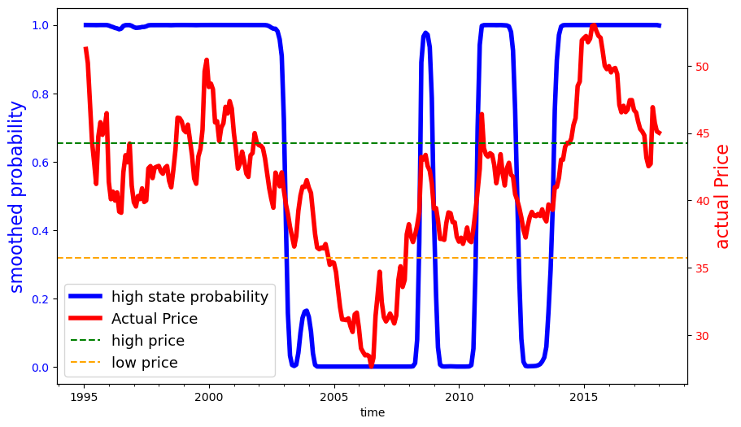
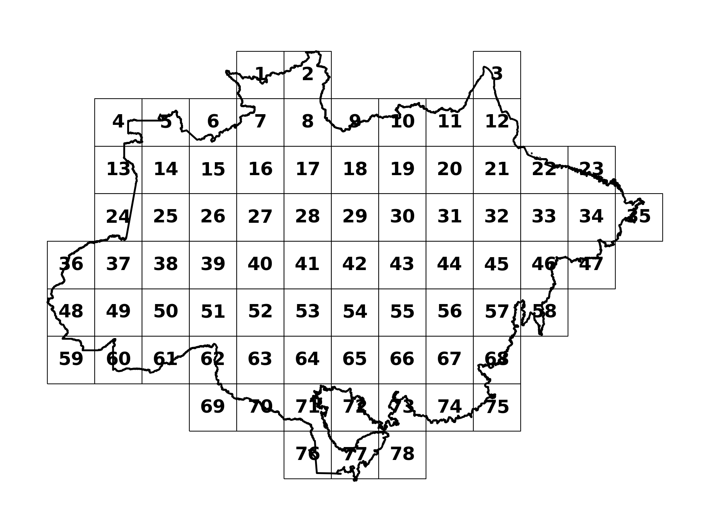
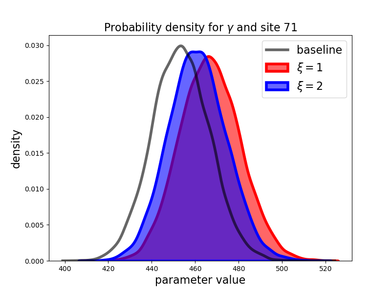
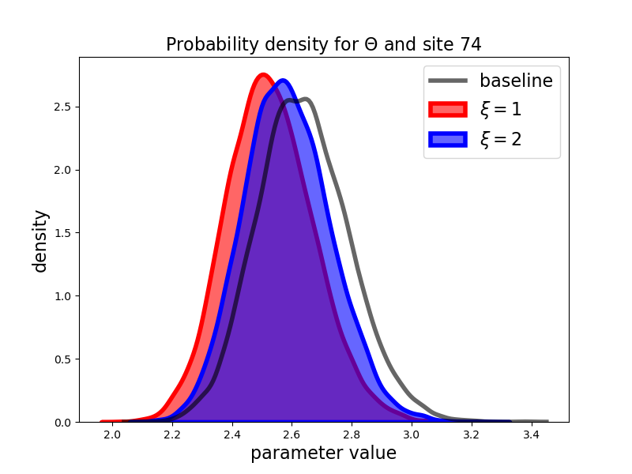

(sec:appendixA)=
# Appendix

<hr style="height:4px; background-color:black; border:none;">

<br>

(appen:data)=
## A Data construction 

### A.1 Total available area

To compute $\bar z^i$, the amount of available area for the planner's
choice (forest or cattle farming) in each site $i$, we first calculate
the fraction of 30m-pixels in site $i$ classified as agriculture
(crops + pastures) or forests in MapBiomas 2017
{cite:t}`souza2020reconstructing`. We then multiply this fraction by the area
(within the biome) of the site, to obtain a measure in hectares. Notice
$\bar z^i$ comprises the total site area, excluding areas such as
rivers, roads, cities and etc.

### A.2 Carbon absorption

We first extract a random sample of 1.2M 30m-pixels and select 893,753
pixels with no deforestation during 1985-2017, which we treat as primary
forests as of 2017. We add *above ground* biomass density data for the
year 2017 from ESA Biomass[^2]. The biomass data also comes in a grid
format with $\sim$ 100m resolution, so we spatially
match it to our sample. The original data is measured in biomass density
(Mg per ha) but we convert it to carbon per hectare, by dividing by 2
(carbon is approximately 50% of the biomass), and then obtain CO2
equivalent by multiplying by 44 and dividing by 12 (based on atomic
mass). In Appendix [C](#appen:baseline) we exposit how we use the data to obtain a
baseline distribution of the vector of site-specific carbon absorption
productivities, $(\gamma^1, \dots, \gamma^I).$

### A.3 Carbon depreciation

The parameter $\alpha$ is a carbon depreciation parameter, assumed to be
constant across sites. It is set so that the 99% convergence time of the
carbon accumulation process is 100 years (see {cite:t}`heinrich2021large`),
that is $\alpha=1-(1-0.99)^{1/100}=.045$.

### A.4 Emissions contributed by agriculture

The parameter $\kappa$ is calibrated using the agricultural net annual
emission data at the state level available from the system SEEG.[^3] We
use $\kappa=2.0942,$ which is the average of agricultural net emission
divided by the agricultural area from MapBiomas for all states within
the Amazon biome, weighting by the area of each state overlap with the
biome, from 1990 to 2019.

### A.5 Cattle farming productivities

Since almost $90\%$ of the historically deforested land in the Amazon
biome that was used for agricultural activities in 2017 was used for
pasture, we focus on the productivity of cattle farming for each site.
Since we do not have measurements concerning the cost of attracting or
redeploying variable inputs to the cattle farming sector, we focus on
revenue per hectare. This choice leads to an overvaluation of the
contribution of cattle farming in the Amazon to the Brazilian
economy.[^4] We consider the value of cattle sold for slaughter per
hectare of pastureland at the municipal level, from the 2017
Agricultural Census {cite:t}`ibge2017agCensus`. In Appendix
[C](#appen:baseline) we
exposit how we derive a baseline distribution for the vector of
site-specific cattle farming productivities,
$(\theta^1, \dots, \theta^I).$

### A.6 Discount rate ($\delta$) and adjustment costs cost ($\zeta$)

We use the discount rate $\delta = 0.02$ and calibrate $\zeta=1.66e-4$
using the difference in price between forested land and cleaned land and
the amount of annual deforestation that occurred from 2008 to 2017 based
on {cite:t}`araujo2022efficient`. Notice that the difference in price should
reflect both the cost of deforestation and any value of wood obtained in
the process. Unfortunately, we did not have data that would allow us to
compute a separate adjustment cost for decreasing (as opposed to
increasing) deforestation, so we opted for symmetry.

(app:initial_values)=
### A.7 Initial values: $Z^i_0$, $X^i_0$ 

The approach for computing the initial value for the agricultural area,
$Z^i_0$, is similar to that used for the total available area
$\bar Z^i$. The only difference is that we focus only on the fraction of
pixels classified as agriculture (crops + pastures) in 2017 before
multiplying by the site's area in order to obtain a measure in hectares.

The initial value for the carbon stored in the forests $X^i_0$ is
assumed to be given by $X^i_0=\gamma^i (\bar{Z}^i - Z^i_0)$, i.e., the
carbon stock per hectare of forest times the forest area. Notice that
$X^i_0$ is measured in CO2e (Mg). Notice that we assume that all forest
at the initial point is primary, which is compatible with equation
[\[eq:x\]](#eq:x).

(appen:agprice)=
### A.8 Agricultural prices 

We use a data series on monthly deflated cattle prices (reference date
01/2017),[^5] from 1995, the year in which the Real Plan stabilized the
Brazilian currency, until 2017.

For the model inputs, we fit a two-state Markov process as a hidden
state Markov chain with with Gaussian noise. We estimated two versions
of this model using the **hmmlearn** package in python. This package
provides a collection of software tools for analyzing Hidden State
Markov Models. In estimation, the hidden states were initialized in the
implied stationary distribution of the transition probabilities through
an iterative process. The implied calibration we used for results
reported in the main body of the paper allowed for the normally
distributed variances to be different depending on the state. We also
considered a specification in which the variances are the same. The
state realizations and transition probabilities for the two
specifications are given in Table
{ref}`tab:hidden-markov-model`.


```{table}  Estimates for the hidden-state Markov models
:name: tab:hidden-markov-model
|      | distinct   | variances  |                          | a common  | variance   |
|------|------------|------------|--------------------------|-----------|------------|
|      | low  price | high price |                          | low price | high price |
|      | 35.71      | 44.26      |                          | 32.44     | 42.78      |
| s.d. | 0.105      | 0.075      |                          | 0.088     | 0.088      |
|      |            |            | transition probabilities |           |            |
|      | low        | high       |                          | low       | high       |
| low  | 0.706      | 0.294      |                          | 0.766     | 0.234      |
| high | 0.171      | 0.829      |                          | 0.046     | 0.954      |
```

<br>

<br>

The smoothed probabilities for both models are given in Figure
[15](#fig:smoothedprobabilities). The more constrained estimation
picks lower values for both states but assumes the process spends most
of its time the higher of the two state.


(fig:smoothedprobabilities)=
 
<br>
<span style="padding-left: 80px;"> Fig 15: Smoothed probabilities for the two hidden state Markov chain
models


Table {ref}`tab:information_criteria` reports the likelihoods and AIC and BIC
model selection diagnostics for both models. The AIC criterion picks the
less constrained of the two models and the BIC criterion just the
opposite.


```{table}  Likelihood ratios and information criteria 
:name: tab:information_criteria
|                | distinct variances | common variance |
|----------------|--------------------|-----------------|
| log likelihood | 270.16             | 268.04          |
| aic            | -528.32            | -526.08         |
| bic            | -502.97            | -504.36         |

```


In Table
{ref}`tab:valueObjectiveDecomposition_78sites_mpc_constrained`, we
report the counterpart to Table
{ref}`tab:valueObjectiveDecomposition_78sites_mpc` constructed
using the implied calibration the same variances for each state. The
differences between results are modest.


```{table}   Present-value decomposition with stochastic agricultural prices
:name: tab:valueObjectiveDecomposition_78sites_mpc_constrained
|          | agricultural output value | net Transfers | forest Services | adjustment Costs | planner Value |
|----------|---------------------------|---------------|-----------------|------------------|---------------|
| $p^a$ =  | stochastic                |               |                 |                  |               |
| b = \$0  |                           |               |                 |                  |               |
| 10\%     | 3.22                      | 0.00          | -1.01           | 0.05             | 2.19          |
| 50\%     | 3.34                      | 0.00          | -1.00           | 0.05             | 2.29          |
| 90\%     | 3.43                      | 0.00          | -0.97           | 0.05             | 2.37          |
| b = \$15 |                           |               |                 |                  |               |
| 10\%     | 0.24                      | 2.00          | 0.84            | 0.19             | 2.89          |
| 50\%     | 0.26                      | 2.00          | 0.84            | 0.19             | 2.91          |
| 90\%     | 0.26                      | 2.00          | 0.84            | 0.19             | 2.91          |
| b = \$25 |                           |               |                 |                  |               |
| 10\%     | 0.16                      | 3.48          | 0.96            | 0.27             | 4.33          |
| 50\%     | 0.18                      | 3.48          | 0.96            | 0.28             | 4.34          |
| 90\%     | 0.19                      | 3.48          | 0.96            | 0.28             | 4.35          |
| $p^a$ =  | \$41.1                    |               |                 |                  |               |
| b = 0    | 3.31                      | 0.00          | -1.10           | 0.06             | 2.14          |
| b = 15   | 0.26                      | 2.02          | 0.95            | 0.17             | 3.06          |
| b = 25   | 0.17                      | 3.54          | 1.00            | 0.26             | 4.45          |
```

(appen:transfer)=
### A.9 Transfer costs 

In this subsection we report in Table
{ref}`tab:transferCost_78sites_hmc_y15` and Table
{ref}`tab:transferCost_78sites_hmc_y30` transfer costs under
ambiguity aversion and Table
{ref}`tab:transferCost_78sites_mpc` transfer costs under
stochastic variation in agricultural prices.


```{table}   Transfer costs under ambiguity - 15 years
:name: tab:transferCost_78sites_hmc_y15
|       |     |                        | ambiguity neutral                  |                           |                        | ambiguity aversion                 |                           |
|-------|-----|------------------------|--------------------------|---------------------------|------------------------|--------------------------|---------------------------|
| b   | net captured emissions | discounted net transfers | discounted effective cost | net captured emissions | discounted net transfers | discounted effective cost |
| 0  | -9.89 | 0.00 | NaN  | -9.59 | 0.00 | NaN  |
| 10 | 5.17  | 0.43 | 2.87 | 4.24  | 0.35 | 2.55 |
| 15 | 6.69  | 0.84 | 5.08 | 5.63  | 0.70 | 4.65 |
| 20 | 7.65  | 1.29 | 7.36 | 6.47  | 1.08 | 6.77 |
| 25 | 8.21  | 1.74 | 9.60 | 6.97  | 1.47 | 8.88 |
```


```{table}   Transfer costs under ambiguity - 30 years
:name: tab:transferCost_78sites_hmc_y30
|       |     |                        | ambiguity neutral                  |                           |                        | ambiguity aversion                 |                           |
|-------|-----|------------------------|--------------------------|---------------------------|------------------------|--------------------------|---------------------------|
| b   | net captured emissions | discounted net transfers | discounted effective cost | net captured emissions | discounted net transfers | discounted effective cost |
| 0  | -15.25 | 0.00 | NaN  | -15.08 | 0.00 | NaN  |
| 10 | 11.91  | 0.87 | 3.21 | 10.18  | 0.74 | 2.93 |
| 15 | 14.10  | 1.57 | 5.37 | 12.57  | 1.39 | 5.03 |
| 20 | 14.75  | 2.23 | 7.43 | 13.15  | 1.97 | 6.97 |
| 25 | 15.08  | 2.87 | 9.47 | 13.29  | 2.51 | 8.86 |
```


```{table}  Transfer costs with stochastic agricultural prices
:name: tab:transferCost_78sites_mpc
|     |                        | 15 years                 |                           |                        | 30 years                 |                           |
|-----|------------------------|--------------------------|---------------------------|------------------------|--------------------------|---------------------------|
|    | net captured emissions | discounted net transfers | discounted effective cost | net captured emissions | discounted net transfers | discounted effective cost |
|    | (billion tons of CO2e) | (\$ $ 10^{11}$)          | ($ per ton of CO2e)       | (billion tons of CO2e) | (\$ $ 10^{11}$)          | ($ per ton of CO2e)       |
| $p^a$ =  |            stochastic               |               |                 |                  |     |       |
| b=\$0                   |                              |                              |       |        |      |      |
| 10\%                      | -9.28                        | 0.00                         | NaN   | -14.41 | 0.00 | NaN  |
| 50\%                      | -8.52                        | 0.00                         | NaN   | -13.79 | 0.00 | NaN  |
| 90\%                      | -7.82                        | 0.00                         | NaN   | -13.33 | 0.00 | NaN  |
| b=\$15                    |                              |                              |       |        |      |      |
| 10\%                      | 6.22                         | 0.77                         | 4.91  | 13.89  | 1.53 | 5.41 |
| 50\%                      | 6.25                         | 0.77                         | 5.21  | 13.91  | 1.53 | 5.53 |
| 90\%                      | 6.29                         | 0.78                         | 5.43  | 13.94  | 1.54 | 5.62 |
| b=\$25                    |                              |                              |       |        |      |      |
| 10\%                      | 7.61                         | 1.59                         | 9.27  | 14.78  | 2.78 | 9.49 |
| 50\%                      | 7.63                         | 1.60                         | 9.78  | 14.79  | 2.78 | 9.70 |
| 90\%                      | 7.65                         | 1.60                         | 10.14 | 14.81  | 2.78 | 9.86 |
| $p^a$ =  |           \$41.1                 |               |                 |                  | | |
| b=0                       | -9.89                        | 0.00                         | NaN   | -15.25 | 0.00 | NaN  |
| b=15                      | 6.69                         | 0.84                         | 5.08  | 14.10  | 1.57 | 5.37 |
| b=25                      | 8.21                         | 1.74                         | 9.60  | 15.08  | 2.87 | 9.47 |

```

(appen:site_map)=
### A.10 Catalog of the sites 

Figure [16](#map-reference) lists the site numbers in the Amazon map as a
reference.

<br>

(map-reference)=


Fig 16: Locations of the different site numbers

(alternative_xi)=
### A.11 Alternative values of $\xi$ 

In this section, we report results for parameter uncertainty with
$\xi=2$. The calculated business as usual price is \$6.1. Table
{ref}`tab:valueObjectiveDecomposition_78sites_hmc_alt_xi` shows
the present values under $\xi=2$ in comparison to $\xi=\infty$. Figure
[17](#fig:Ambiguity_adjustment_b0) and Figure
[18](#fig:Ambiguity_adjustment_b15) shows the baseline and
ambiguity-adjusted distributions.


```{table}  Present-value decomposition - parameter ambiguity $\xi=2$
:name: tab:valueObjectiveDecomposition_78sites_hmc_alt_xi
|    |              | agricultural output |         |              | planner value |         |
|----|--------------|---------------------|---------|--------------|---------------|---------|
| b  | $\xi=\infty$ | $\xi=2$             | $\xi=1$ | $\xi=\infty$ | $\xi=2$       | $\xi=1$ |
| 0  | 3.31         | 2.87                | 2.57    | 2.14         | 1.86          | 1.64    |
| 10 | 0.41         | 0.50                | 0.55    | 2.41         | 2.22          | 2.08    |
| 15 | 0.26         | 0.28                | 0.30    | 3.06         | 2.81          | 2.62    |
| 20 | 0.20         | 0.22                | 0.23    | 3.75         | 3.43          | 3.19    |
| 25 | 0.17         | 0.18                | 0.19    | 4.45         | 4.06          | 3.74    |
```


<br>

(fig:Ambiguity_adjustment_b0)=
 
 
<br>
<span style="padding-left: 80px;"> Fig 17: Baseline and ambiguity adjusted densities for b = 0 


<br>

(fig:Ambiguity_adjustment_b15)=
 
 
<br>
<span style="padding-left: 80px;"> Fig 18: Baseline and ambiguity adjusted densities for b = 15 

(appen:discrete_model)=
## B Model discretization 

In order to obtain numerical solutions for the social planner problem,
we solve the following discrete-time approximation, for a finite horizon
of $T=200$ years[^6]:

$$
\max_{\{U_t, V_t\}^T_{t=1}} \; \sum^{T}_{t=0} e^{-\delta t} 
\left[
-P^e   \sum^I_{i=1} \kappa Z^i_{t+1} - (X^i_{t+1} - X^i_{t})
+ P^a \sum^I_{i=1} \theta^i Z^i_{t+1} 
- \frac{\zeta}{2} \left(\sum^I_{i=1} U^i_t + V^i_t\right)^2 \right],$$ (eq:discrete_model)

subject to the initial conditions in
[A.7](#app:initial_values) and the constraints: 

$$\begin{aligned}
    X^i_{t+1} &= X^i_t  
    -\gamma^i U^i_t
    - \alpha \left[ X^i_t
    - \gamma^i ({\bar z}^i - Z^i_t)\right]
    &\forall i=1,\dots I \text{ and } t=0,\dots, T 
\end{aligned}$$   (eq:discrete_model_x)
    
    
$$ \begin{aligned}
Z^i_{t+1} &= Z^i_t + U^i_t - V^i_t
&\forall i=1,\dots I \text{ and } t=0,\dots,T 
\end{aligned}$$ (eq:discrete_model_z)
$$ \begin{aligned}
    U^i_t &\geq 0, \quad V^i_t \geq 0
    &\forall i=1,\dots I \text{ and } t=0,\dots,T
\end{aligned}$$ (eq:discrete_model_control)

(appen:baseline)=
## C Benchmark distributions 

Equation
[\[productivity_construct\]](#productivity_construct) gave the formula for constructing
measurement of site-specific productivities from regression coefficients
and measurements of municipality attributes. In what follows, we first
outline the municipality regression models used for $\gamma$ and
$\theta$, and then we describe the procedure that we used constructing
baseline Bayesian posteriors for the regression coefficients.

### C.1 $\theta's$

To construct a measurement of the $\theta$'s, we run the regression
specification below with probabilistic output.[^7]

$$
\log(\text{Slaughter value}) = R_\theta \beta_\theta + \epsilon_\theta$$ (eq:betathetamuni)

where 

$$\begin{aligned}
R_\theta \beta_\theta \mathrel{\overset{\mathrm{def}}{=}}& \quad \beta_\theta^{0} + \beta_\theta^{1}(\operatorname{historical\_precip})
+ \beta_\theta^{2}(\operatorname{historical\_temp}) + \beta_\theta^{3}(\operatorname{historical\_temp^2})\cr & 
\quad + \beta_\theta^{4}(\operatorname{lat}) + \beta_\theta^{5}(\operatorname{lat^2})  + 
 \beta_\theta^{6}\operatorname{\text{log}(cattleSlaughter\_farmGatePrice}) + \beta_\theta^{7}(\operatorname{distance})
\end{aligned}$$ 

where slaughter value is the value of cattle sold per
hectare of pasture area in 2017 (USD/ha), precipitation and temperature
are the average annual precipitation (mm) and temperature (degrees
Celsius), respectively, for the period of 1970-2000
{cite:t}`fick2017worldclim`, latitude is the geographical coordinates of the
municipality centroids, farm gate price is the price of cattle slaughter
{cite:t}`seabpr2021price`, and distance is measured the distance from the
municipality to the state capital. Since the area dedicated to
agriculture varies substantially across municipalities, we opted for
weighting observations by the 2017 pasture area in each municipality.

The inclusion of farm gate prices on the right side of this regression
is reasonable because variations in farm gate prices across
municipalities mostly reflect unobserved costs to bring cattle to
stockyards and meat to markets such as proximity to roads or rivers,
which are not fully controlled by our geographical variables.

### C.2 $\gamma's$

We calculate average of CO2 density (MG/ha) for each municipality and
run the following regression:[^8]

$$\operatorname{\text{log}(co2e\_ha)} = R_\gamma \beta_\gamma + \varepsilon_\gamma$$

where 

$$\begin{aligned}
R_\gamma \beta_\gamma \mathrel{\overset{\mathrm{def}}{=}}& \quad  \beta^\gamma_{0} + \beta^\gamma_{1}(\operatorname{\text{log}(historical\_precip}))
+ \beta^\gamma_{2}(\operatorname{\text{log}(historical\_temp}))  \cr & 
\quad \beta^\gamma_{3}(\operatorname{\text{log}(lat)}) + \beta^\gamma_{4}(\operatorname{\text{log}(lon)}).
\end{aligned}$$

### C.3 Posterior estimation

To estimate the benchmark posterior distribution $\pi$, we consider
$\pi(\beta_\theta, \sigma^2_\theta)$ and
$\pi(\beta_\gamma, \sigma^2_\gamma)$ separately. Below, we present the
derivation of $\pi(\beta_\theta,  \sigma^2_\theta)$, with the derivation
of $\pi(\beta_\gamma,\sigma^2_\gamma)$ following analogously.

Using a weighted regression for the model given by
[\[eq:betathetamuni\]](#eq:betathetamuni) with a Gaussian error term is equivalent
to assuming: 

$$
   Y_\theta  \;=\; R_\theta\beta_\theta + \varepsilon_\theta, \quad \varepsilon_\theta \sim \mathcal{N}(0,\, \sigma_\theta^2 W_\theta ^{-1}),$$ (eq:muni_likelihood)

where: $W_\theta$ is the diagonal matrix of weights. For the $\gamma$
case, $W_\gamma = I.$

We assume that the priors/posteriors for parameters
$(\beta_\theta, \sigma_\theta^2)$ are the familiar conjugate form:

$$\beta_\theta \;|\;  \sigma_\theta^2 \; \sim \; \mathcal{N}(m,\, \sigma_\theta^2 Q^{-1})$$ (eq:Posterior_beta)

$$\sigma_\theta^2 \;\sim\; \textrm{Inv-Gamma}(a,\, b)$$ (eq:Posterior_sigma)

where

$$\begin{aligned}
    Q & = R_\theta' W_\theta R_\theta + Q_0, \cr
    m & = Q^{-1} (R_\theta' W_\theta y_\theta + Q_0m_0), \cr
    a & = a_0+\frac{n}{2}, \cr
    b & = b_0+\frac{1}{2}(y_\theta' W_\theta y_\theta + m_0' Q_0 m_0- m'Qm),
\end{aligned}$$ 

and $Q_0, m_0, a_0, b_0$ are prior inputs. We impose the
familiar improper priors: 

$$\begin{aligned}
    \begin{matrix} Q_0 = 0  & m_0 = 0 & a_0 = 0 & b_0 = 0 \end{matrix},
\end{aligned}$$ 

which implies that the posteriors inputs are familiar
regression statistics. In the following tables, we present quantiles for
the posterior distributions described above:


```{table}  Quantiles for θ posterior estimation
:name: tab:theta_estimation
|      | $\beta_0^{	\theta}$ | $\beta_1^{\theta}$ | $\beta_2^{\theta}$ | $\beta_3^{\theta}$ | $\beta_4^{\theta}$ | $\beta_5^{\theta}$ | $\beta_6^{\theta}$ | $\beta_7^{\theta}$ |
|------|-------------------|--------------------|--------------------|--------------------|--------------------|--------------------|--------------------|--------------------|
| 10\% | 3.899             | -0.189             | 1.274              | -5.250             | 5.466              | -7.871             | 0.454              | -0.132             |
| 50\% | 3.943             | -0.135             | 3.201              | -3.343             | 6.607              | -6.732             | 0.495              | -0.091             |
| 90\% | 3.986             | -0.082             | 5.080              | -1.404             | 7.729              | -5.576             | 0.537              | -0.051             |

```

```{table}  Quantiles for γ posterior estimation
:name: tab:gamma_estimation
|      | $\beta_0^{\gamma}$ | $\beta_1^{\gamma}$ | $\beta_2^{\gamma}$ | $\beta_3^{\gamma}$ | $\beta_4^{\gamma}$ |
|------|--------------------|--------------------|--------------------|--------------------|--------------------|
| 10\% | 5.918              | 0.055              | -0.172             | 0.148              | -0.313             |
| 50\% | 5.936              | 0.079              | -0.146             | 0.177              | -0.291             |
| 90\% | 5.955              | 0.102              | -0.119             | 0.206              | -0.269             |
```


(sec:appendixD)=
## D Hamiltonian Monte Carlo 

As is standard in applications of MCMC, we use numerical simulation to
compute the probability distribution induced by the density of
[\[minimizer\]](#minimizer). While we have partially analytic expression for
the numerator, the integration in the denominator is more problematic.
This challenge is a typical starting point for MCMC computations.

Although we are interested in only the distribution for the regression
coefficients, for numerical tractability we use the conditional normal
inverse gamma specification in our computations, which includes the
regression error variances. We then construct numerically the implied
marginal distribution for the regression coefficients consistent with
formula [\[minimizer\]](#minimizer).

This means that we sample from 

$$
{\exp\left[ - {\frac 1 \xi } f(d,  \beta )\right]} d\pi(\beta_\theta, \sigma^2_\theta | R_\theta, y_\theta) d\pi(\beta_\gamma, \sigma^2_\gamma | R_\gamma, y_\gamma)
$$ (eq:target_distribution)

If $\rho:=(\beta, \sigma^2),$ taking logs and multiplying by $-1$, we
get the potential energy term $\mathcal{U}$:

$$\begin{aligned}

        \mathcal{U}(\rho) {} & = {\frac 1 \xi } f(d, \beta) 
        - \log d\pi(\beta_\theta, \sigma^2_\theta | R_\theta, y_\theta) - \log d\pi(\beta_\gamma, \sigma^2_\gamma | R_\gamma, y_\gamma)
\end{aligned}$$ (eq:potential_energy_first)

$$\begin{aligned}
        {} & = {\frac 1 \xi } f(d,  \beta) 
        - \log d\pi(\beta_\theta | \sigma_\theta^2, R_\theta, y_\theta)  - \log d\pi(\beta_\gamma | \sigma_\gamma^2, R_\gamma, y_\gamma) 
         \\
           & \qquad - \log d\pi(\sigma_\theta^2 | R_\theta, y_\theta) - \log d\pi(\sigma_\gamma^2 | R_\theta, y_\gamma)
\end{aligned}$$ (eq:potential_energy_second)

HMC relies on an auxiliary momentum vector $\omega$ of
the same dimension as $\rho$, where $\omega \sim \mathcal{N}(0, M)$ and
$M$ is a symmetric, positive-definite mass matrix. The Hamiltonian is
then defined as:

$$\mathcal{H}(\rho, \omega) :=  \mathcal{U}(\rho) + \frac{1}{2} \omega'M^{-1}\omega$$ (eq:Hamiltonian)

The HMC algorithm then consists of:

1.  Initialize $\rho_{(0)}$.

2.  Sample momentum $\omega_{(0)} \sim N(0,M)$.

3.  Generate a state proposal
    $(\tilde{\rho}_{(0)}, \tilde \omega_{(0)})$ by evolving its position
    according to Hamilton's equations, using the leapfrog integrator
    with step size $\epsilon$ and a number of steps $L$:

    $$\begin{aligned}
                  \frac{d \rho}{d t}   & = \frac{\partial \mathcal{H}}{\partial \omega} 
        \end{aligned}$$ (eq:partial_state)

    $$\begin{aligned}
                  \frac{d \omega}{d t} & = -\frac{\partial \mathcal{H}}{\partial \rho}
              
    \end{aligned}$$ (eq:partial_momentum)


4.  Perform a Metropolis test to accept or reject the state update
    $(\rho_{(1)}, \omega_{(1)}) \leftarrow (\tilde{\rho}_{(0)}, \tilde \omega_{(0)})$,
    with the acceptance probability given by:

    $$\min \left\{1, \ \exp \left( \mathcal{H}(\rho_{(0)}, \omega_{(0)}) - \mathcal{H}(\tilde{\rho}_{(0)}, \tilde \omega_{(0)}) \right) \right\}$$

5.  Repeat steps 2-4 until the desired number of samples is reached.

We then iterate between solving the planner's problem for $d$ and
sampling $\rho$ as follows:

1.  Initialize $\varphi_{(0)}$ as the transformed mean of the baseline
    distribution $\pi$.

2.  Solve the planner's problem for decision vector $d_{(0)}$ using the
    updated parameters.

3.  Sample $\{ \rho_{(s)} \}^{4000}_{s=1}$ from
    {eq}`eq:target_distribution` by running HMC simultaneously
    across 4 independent Markov chains, taking 1000 samples and 500
    burn-in samples per chain.

4.  Transform samples $\{ \beta_{(s)} \}^{4000}_{s=1}$ back into the
    $\varphi$ space, compute $\bar{\varphi}$ as the mean across samples,
    and update $\varphi$ using
    $\varphi_{(t+1)} := w \bar{\varphi} + (1-w) \varphi_{(t)}$, with
    $w=0.25$.

5.  Repeat steps 2 -- 4 until
    $||\varphi_{(t+1)} - \varphi_{(t)} ||_{\infty} < 0.001$.

### D.1 Computational implementation details

To sample from
{eq}`eq:target_distribution`, we rely on the Stan software
{cite:t}`carpenter2017`, {cite:t}`standev2018stancore` for high-performance statistical
computation. The Stan implementation for HMC makes a few adaptations to
the algorithm described above to improve computation speed and sampling
efficiency. We summarize these below:

-   To ensure convergence onto the stationary target distribution, Stan
    discards the pre-specified number of burn-in samples at the start of
    the sampling process.  

-   Stan utilizes the No U-turn sampling (NUTS) variant of HMC, which
    adaptively determines the number of leapfrog steps $L$ at each
    iteration to avoid U-turns in the state trajectory
    {cite:t}`JMLR:v15:hoffman14a`, {cite:t}`betancourt2016identifying`.

-   Stan determines the leapfrog step size $\epsilon$ using the dual
    averaging Nesterov algorithm {cite:t}`nesterov2009primal`.

-   By default, Stan utilizes a diagonal matrix for $M$ which is
    estimated using the burn-in samples collected at the start of the
    algorithm.

-   Stan uses reverse-mode automatic differentiation to compute the
    Hamiltonian gradient.


<br>
<hr style="height:4px; background-color:black; border:none;">

[^1]: We thank Pengyu Chen, Bin Cheng, Patricio Hernandez, João Pedro
    Vieira, Daniel (Samuel) Zhao for their expert research assistance
    and to Joanna Harris and Diana Petrova for their helpful comments
    and to Carmen Quinn for editorial assistance. Assunção's research
    was supported by the Climate-Policy Initiative-Brazil, Hansen's
    research was supported in part by the Griffin Applied Economics
    Incubator Project on Policy-making in an Uncertain World and by an
    EPIC/Argonne National Laboratory collaboration award, and
    Scheinkman's research was supported in part by the Columbia Climate
    School.

[^2]: {cite:t}`santoro2021esa`

[^3]: Sistema de Estimativas de Emissões e Remoções de Gases de Efeito
    Estufa. Available in http://seeg.eco.br/.

[^4]: In contrast to other areas in Brazil, average value of slaughter
    per hectare of pasture in the Amazon, decreased between 2006 and
    2017, making it doubtful that future productivity will increase.

[^5]: Commodity prices from SEAB-PR. Secretaria da Agricultura e do
    Abastecimento do Estado do Paraná (SEAB-PR). 2021. \"Preço Médio -
    Recebido pelo Agricultor: boi gordo, arroz (em casca),
    cana-de-açúcar, milho, mandioca, 1990-2021.\" Secretaria da
    Agricultura e do Abastecimento do Estado do Paraná, Departamento de
    Economia Rural \[publisher\], Instituto de Pesquisa Econômica
    Aplicada, Ministério da Economia \[distributor\].
    http://www.ipeadata.gov.br (accessed February 22, 2021)

[^6]: Since period-payoff can be bounded by a constant, given the
    discount rates we use, the loss in precision for trajectories in the
    first 30 years, which is our period of interest, is small.

[^7]: We standardize the regressors prior to the posterior estimation.

[^8]: We again standardize the regressors.
