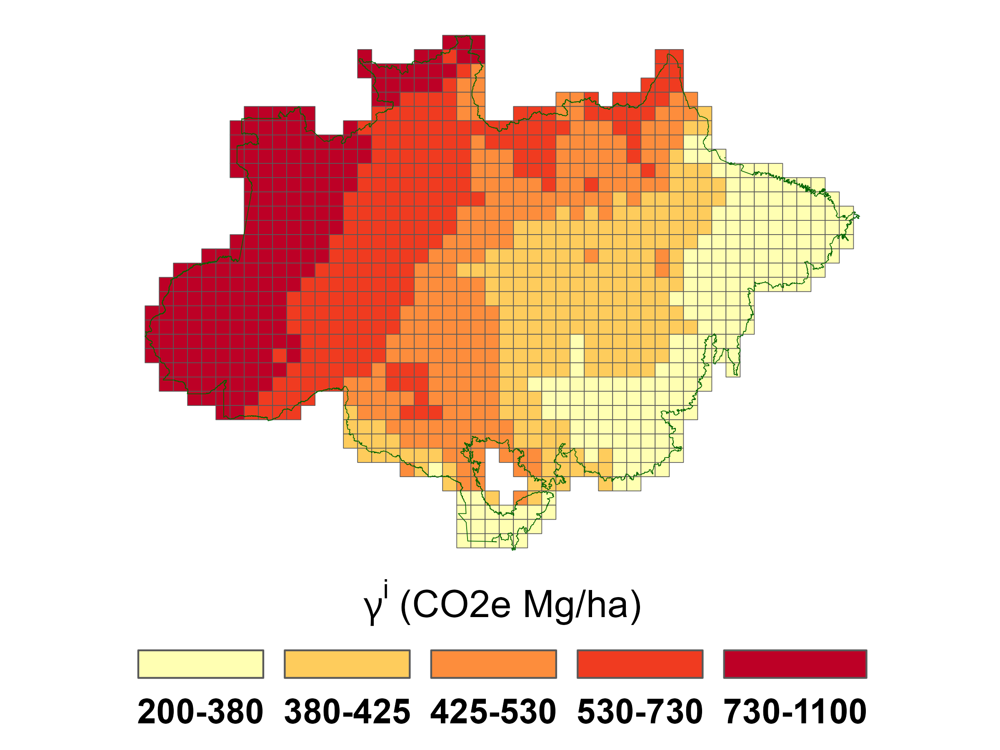
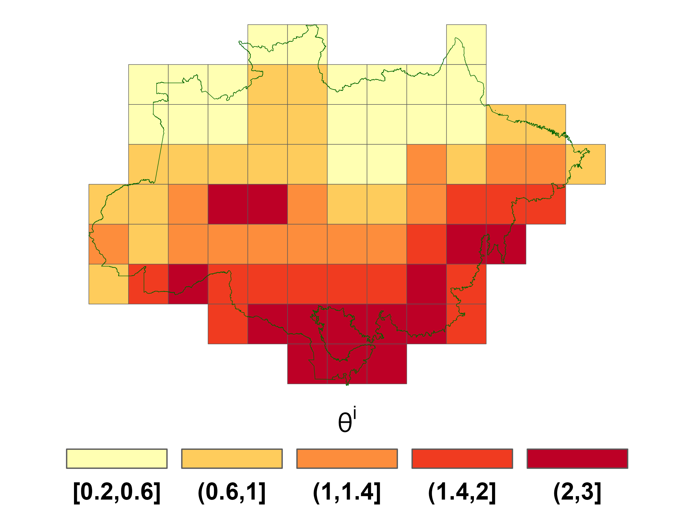

(sec:cal)=
# Productivity measurement 

 

As discussed in section
[4](#sec:uncertainty), we construct site specific productivity
estimates from the output of regression equations. See formula
{eq}`productivity_construct`. Appendix
[A](#sec:appendixA) describes in detail all data used for these
regressions. What follows is a summary of the evidence that we draw on.

For input into the agricultural productivity regression, we use the year
of 2017 as a reference for many variables, since this is latest
Agricultural Census in Brazil. For the regressand, this census provides
information on the value of cattle sold for slaughter per hectare of
pasture land at the level of a municipality.[^2] As regressors, we use
geographical variables as stipulated in Appendix
[A](#sec:appendixA). The census provides observations on the value
of cattle sold for slaughter per hectare of pasture land for 466
municipalities out of the 540 municipalities that intersect the biome.
Since we have data on the regressors, and we use regression predictions
to attribute values to the remaining municipalities and to obtain
agricultural productivities, the $\theta^i$'s.

For measuring the productivity of carbon sequestration, the
$\gamma^i$'s, we first use data from MapBiomas [^3] to select pixels of
$100m\times 100m$ that can be considered primary forests. Given this
partitioning, we used 2017 data from ESA Biomass[^4] to obtain carbon
per hectare. We then calculate average productivities for each
municipality. Analogous to the procedure we used for the $\theta_i$'s,
we run a regression using the MapBiomas data as regressands and
geographical variables as regressors to obtain estimates at the spatial
resolutions used in our model.

We use two different spatial resolutions for the results that we report.
In both cases, we project municipal estimates into two grids of the
Amazon biome. At the most detailed level we consider a regular grid of
the Amazon region with pixels of 30m $\times$ 30m resolution from
MapBiomas {cite:t}`souza2020reconstructing`. We then aggregate pixels to form
1887 sites that are 67.5 km $\times$ 67.5km. Many of these sites do not
overlap the Amazon biome. We discard these and twenty others with less
than 3% of their area in the Amazon biome. This reduced our number to
1043 sites.

For reasons of tractability, when we consider either a stochastic
evolution of agricultural prices or uncertainty in the productivity
parameters, we use a less refined grid of 130 sites that are
approximately 270km $\times$ 270km. We obtain 78 sites after dropping
sites that do not overlap the Amazon biome at all and four additional
sites with less than 3% in the Amazon biome.

Figure [2](#fig:map) shows the
initial land allocated to agriculture and the initial stock of absorbed
carbon across the 1043-grid sites. Figure
[3](#fig:gamma) shows how
the carbon sequestration parameter $\gamma^i$ varies across the
different sites, and Figure [4](#fig:theta) does the same for the agricultural productivity
parameter, $\theta^i$. The correlation between $\theta^i$ and $\gamma^i$
is $-.35$ for the finer resolution and $-.44$ for the coarser
resolution. Thus, while agricultural productivity and carbon absorption
capacity are negatively correlated, this relationship is imperfect.

 

(fig:map)=
 
 
 Fig 2: Initial values for agricultural area $z_0^i$ and carbon stock $x_0^i$

 

(fig:gamma)=
 
 
 Fig 3. Carbon sequestration parameters (left: 1043 sites, right: 78 sites).

 

(fig:theta)=
 
 
 Fig 4. Agricultural productivity heterogeneity  (left: 1043 sites, right: 78 sites).

 

[^1]: We thank Pengyu Chen, Bin Cheng, Patricio Hernandez, João Pedro
    Vieira, Daniel (Samuel) Zhao for their expert research assistance
    and to Joanna Harris and Diana Petrova for their helpful comments
    and to Carmen Quinn for editorial assistance. Assunção's research
    was supported by the Climate-Policy Initiative-Brazil, Hansen's
    research was supported in part by the Griffin Applied Economics
    Incubator Project on Policy-making in an Uncertain World and by an
    EPIC/Argonne National Laboratory collaboration award, and
    Scheinkman's research was supported in part by the Columbia Climate
    School.

[^2]: Considering the total revenue of the cattle ranching activity, we
    may be overestimating its importance. It accounts not only for the
    value created in the local economy, in the form of profits and wages
    but also for some inputs specifically consumed in production.
    Unfortunately, our data does not allow us to construct a reliable
    measure for the value added by grazing in the Brazilian Amazon.

[^3]: Web address: www.mapbiomas.org (Collection 5).

[^4]: See {cite:t}`santoro2021esa`.
