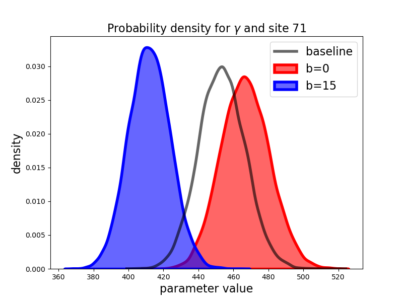
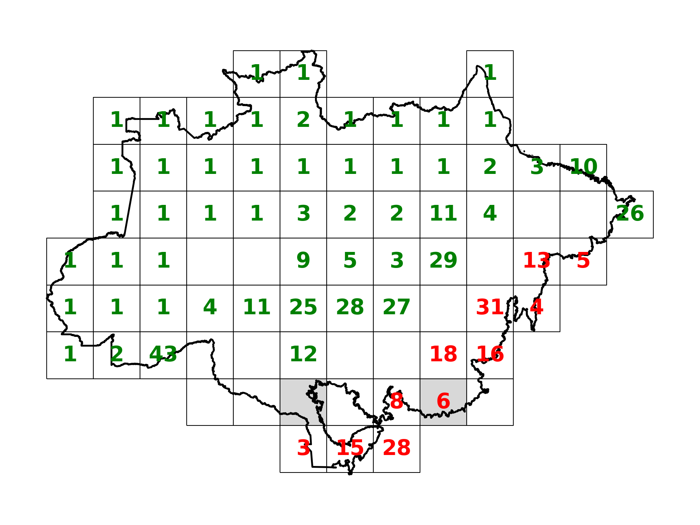

## Results with robustness to parameter uncertainty

<hr style="height:4px; background-color:black; border:none;">

<br>

In this section, we present results when the planner is uncertain about
cattle productivity and CO$_2$ capture potential. While it is revealing
to perform robustness calculations for several values of $\xi$, here we
report results only for $\xi = \infty$ and $\xi=1.$ We refer to the
former as 'ambiguity neutral' and the latter as 'ambiguity averse.' We
report results for other values of $\xi$ in the appendix
[A.11](#sec:appendixA). The implied ambiguity adjustments to the
probabilities help us gauge the plausibility of different values of
$\xi.$ The calculated shadow price, as reported in Table
{ref}`tab:shadow_price`, is \$7.1/ton under ambiguity neutrality
and a considerably lower value of \$5.3/ton under ambiguity aversion.
The shadow price reduction under ambiguity aversion compensates for the
slower destruction of the forests when there is ambiguity in the
agricultural productivities for the various sites.

Figure [9](#fig:Ambiguity adjustment) shows the baseline and
ambiguity-adjusted distributions for parameters $\gamma$ and $\theta$
when $b=0$ and $b=15.$ We display results for the two sites with largest
divergence between the baseline probability distributions and the
ambiguity-adjusted counterparts for sake of illustration.[^3] When
looking across all sites, the adjustments are very heterogeneous; and
for some sites there is very little difference between the two
distributions.

Under the business-as-usual benchmark, the adjustments are more
pronounced for the $\theta$ distributions than for the $\gamma$
distributions. In other words, it is the uncertainty about agricultural
productivity that the social planner finds to be most concerning since
the planner is not incentivized to preserve the rain forest without
transfer payments.[^4] The uncertainty adjustment to the probabilities
are substantially different when $b=15.$ Now the adjustments are more
pronounced for the $\gamma$ probability distributions because
reforestation becomes a more prominent ambition for the planner.


<br>

(fig:Ambiguity adjustment)=
 
 
<br>
<span style="padding-left: 80px;"> Fig 9: Baseline and ambiguity adjusted densities for b = 0 and b = 15


Some sites are deforested, and some sites are reforested by the planner
in the absence of external transfer payments. Figures
[10](#fig:map-hmc-b0_at_price_neutral),
[12](#map-hmc-b0), and
[13](#map-hmc-b15) show the
years in which one of the two controls is maximal for the individual
sites. Recall that $U_t^i > 0$ is when site $i$ is being deforested, and
$V_t^i>0$ when the site $i$ is being reforested. Only one of these can
be strictly positive at any date $t$.

Figure [10](fig:map-hmc-b0_at_price_neutral) compares what happens when
$b=0$ under ambiguity aversion, using the same business-as-usual carbon
emission price as we used under ambiguity neutrality. As examples, the
two sites featured in Figure
[9](#fig:Ambiguity adjustment) are shaded in. For instance, for
site 71, the change in land allocation moves from year fifteen to one in
which there is no change in land allocation over the time span of 50
years. For site 74 the change is from year three under ambiguity
neutrality to year six under ambiguity aversion. The delay is because
the planner is particularly skeptical of the baseline distribution for
the site-specific agricultural productivity as displayed in Figure
[9](#fig:Ambiguity adjustment). More generally, Figure
[12](#map-hmc-b0) shows how
the delays in deforestation and accelerations of reforestation for all
of the 78 sites under ambiguity aversion, in the absence of transfer
payments. Overall, the ambiguity aversion decreases substantially the
land allocated to agriculture as is evident from Figure
[11](#aggz-hmc_at_price_neutrality).


(fig:map-hmc-b0_at_price_neutral)=
 

<br>
Fig 10: Spatial allocation comparison for <span
class="math inline"><em>b</em> = 0</span> for common <span
class="math inline"><em>P</em><sup><em>e</em><em>e</em></sup> = $7.1</span>.
<span> Green</span> number in a site is the year of maximal rate of
reforestation. <span>Red</span> number in a site is the year of maximal
deforestation. Sites 71 and 74 are shaded. Ambiguity neutral left, ambiguity averse right.


<br>

(aggz-hmc_at_price_neutrality)=


Fig 11: Evolution of agricultural area under ambiguity neutrality and
ambiguity aversion for $b=0$ at a common business-as-usual carbon price,
$P^{ee} = 7.1.$


The previous results hold the business-as-usual price fixed as we
introduce ambiguity aversion. As we know from Table
{ref}`tab:shadow_price`, this price decreases endogenously when we
impose ambiguity aversion from $7.1$ to $5.3.$ Not surprisingly, this
has a big impact on both the spatial-dynamic land allocation as we show
in Figure [12](#map-hmc-b0).
While ambiguity aversion still shifts the dates of the maximal
responses, it now does so in a much more muted way than in Figure
[10](fig:map-hmc-b0_at_price_neutral).


(map-hmc-b0)=
 

<br>
Fig 12: Spatial allocations for <span
class="math inline"><em>b</em> = 0</span>, <span
class="math inline"><em>P</em><sup><em>e</em><em>e</em></sup> = 7.1</span>
for ambiguity neutral and <span
class="math inline"><em>P</em><sup><em>e</em><em>e</em></sup> = 5.3</span>
for ambiguity averse, the corresponding shadow prices. The <span>
green</span> number in a site is the year in which the rate of
reforestation is maximal. The <span> red</span> number in each site is
the year in which deforestation is maximal. Sites 71 and 74 are
shaded. Ambiguity neutral left, ambiguity averse right.

<br>

<br>

As shown in Figure [13](#map-hmc-b15), when $b= 15$, there is only reforestation. The
dates of maximal reforestation turn out show only limited sensitivity to
the ambiguity aversion in this case. For instance, consider site 71,
which we featured in the top panel of Figure
[9](#fig:Ambiguity adjustment) and is shaded in Figure
[13](#map-hmc-b15). Under
ambiguity neutrality, the planner's peak reforesting takes place in year
five; and under ambiguity aversion, this action is delayed until year
seven. For site 74, the maximal response is delayed from year eighteen
to year twenty-one. The source of these and other modest delays are due
to uncertainty about carbon sequestration productivities.


(map-hmc-b15)=
 

<br>
Fig 13: Spatial allocation for <span
class="math inline"><em>b</em> = 15,</span> using the corresponding
shadow prices. The number in each site is the year in which
reforestation in that site is maximal. Ambiguity neutral left, ambiguity averse right.

<br>

<br>

The left panel of Figure [14](#aggz-hmc) shows a notable contrast with Figure
[11](#aggz-hmc_at_price_neutrality). Resetting the
business-as-usual price under ambiguity aversion has big impact on the
aggregate land allocation dynamics when $b= \$0$. Consistent with the
spatial dynamics reported in Figures
[12](#map-hmc-b0) and
[13](#map-hmc-b15), Figure
[14](#aggz-hmc) shows that
once we adjust the business-as-usual price change, there is only a very
modest impact in the aggregate land allocation with and without
ambiguity aversion. This holds true for $b = \$15$ as well.


(aggz-hmc)=
 

<br>
Fig 14: Evolution of agricultural area under ambiguity neutrality
and ambiguity aversion, using the corresponding shadow prices.

<br>

<br>

Finally, we consider the present values under ambiguity aversion
($\xi = 1$) in comparison to ambiguity neutrality ($\xi = \infty)$ in
Table
{ref}`tab:valueObjectiveDecomposition_78sites_hmc`. As should be
expected, the ambiguity aversion induces smaller present values since
they are computed with uncertainty adjusted probabilities. The
specification of $b$ determines either a net tax or subsidy depending on
its magnitude. Over the range of transfers implied by $b$'s in excess of
$\$10$ per ton, the planner's discounted objective increases and is
greater than that for $b = \$0$ under both ambiguity neutrality and
ambiguity aversion. In this range, $\$b$ functions as a net subsidy,
implying that the planner would strictly prefer outcomes under these
scenarios to the business-as-usual outcome.

Table
{ref}`tab:valueObjectiveDecomposition_78sites_hmc` also reports
the discounted present value of agricultural output. For $b=0$, the drop
in the present value contribution of agriculture is over twenty percent.
This drop is consistent with the reduction in land allocated to
agriculture under ambiguity aversion as reported in Figure
[14](#aggz-hmc). In addition,
the ambiguity-adjusted probability densities provide a more conservative
assessment of agricultural productivity than the baseline densities. For
the other choices of $b$ in Table
{ref}`tab:valueObjectiveDecomposition_78sites_hmc`, the
contributions are very small but increase under ambiguity aversion. The
reason for the increase is that, under ambiguity aversion, the planner
makes a more cautious assessment of the ability of the Brazilian rain
forest to absorb carbon, leading to a very small increase in the land
allocated to agriculture.


```{table}  Present-value decomposition - parameter ambiguity
:name: tab:valueObjectiveDecomposition_78sites_hmc
|     |  | agricultural output    |    |           | planner  value |    |
|-----|--------------|-----------|---------|-----------|-----------|---------|
| b   | ambiguity    | ambiguity | percent | ambiguity | ambiguity | percent |
| ($) | neutral      | aversion  | change  | neutral   | aversion  | change  |
| 0   | 3.31         | 2.57      | -22.4   | 2.14      | 1.64      | -23.4   |
| 10  | 0.41         | 0.55      | 33.6    | 2.41      | 2.08      | -13.9   |
| 15  | 0.26         | 0.30      | 14.2    | 3.06      | 2.62      | -14.4   |
| 20  | 0.20         | 0.23      | 12.9    | 3.75      | 3.19      | -15.0   |
| 25  | 0.17         | 0.19      | 11.9    | 4.45      | 3.74      | -15.8   |
```

<br>

<br>

**Remark 1**. *In contrast to land allocation process, $Z,$ with
parameter ambiguity, the state vector process, $X$, of captured carbon
is disguised to the planner, because initial conditions and the dynamics
of carbon captured depend on the value of $\gamma.$ This has
ramification for policy since we presume transfer payments are based on
carbon reduction. Under ambiguity aversion, our planner uses the
ambiguity-adjusted probabilities to compute these payments. In *ad hoc*
policy-making settings distinct from our fictitious planner formulation,
one could imagine differences in perspective among providers and
recipients of transfers opening the door to explicit consideration of
differences in their aversion to uncertainty. Also, parameter
uncertainty opens the door to explicit learning that we abstract from
here. Rather than being purely passive, this learning could offer the
potential for experimentation as a way to gain a better understanding of
site-specific productivities.*


<br>
<hr style="height:4px; background-color:black; border:none;">

[^1]: We thank Pengyu Chen, Bin Cheng, Patricio Hernandez, João Pedro
    Vieira, Daniel (Samuel) Zhao for their expert research assistance
    and to Joanna Harris and Diana Petrova for their helpful comments
    and to Carmen Quinn for editorial assistance. Assunção's research
    was supported by the Climate-Policy Initiative-Brazil, Hansen's
    research was supported in part by the Griffin Applied Economics
    Incubator Project on Policy-making in an Uncertain World and by an
    EPIC/Argonne National Laboratory collaboration award, and
    Scheinkman's research was supported in part by the Columbia Climate
    School.

[^2]: Recall, however, that we use a measure of full output as value
    added. Thus, we have exaggerated the loss of agricultural output.

[^3]: The sites were selected at the imposed business-as-usual price
    under ambiguity averse. See Figure
    [16] in Appendix
    [A.10](#sec:appendixA) for a map of the site locations.

[^4]: Notice that the uncertainty adjusted $\gamma$ distributions
    actually shift to the right when $b = \$0.$

[^5]: Appendix [\[appen:agprice\]](#appen:agprice){reference-type="ref"
    reference="appen:agprice"} gives results for a second estimation of
    the hidden-state Markov process in which Gaussian shock variances
    are constrained to be the same. In this case, both realized states
    are lower and most of the time is spent in the higher of the two
    states.

[^6]: To construct the business-as-usual price for emissions when the
    agricultural prices are stochastic, we used the smoothed
    probabilities reported in left panel of Figure
    [\[fig:smoothedprobabilities\]](#fig:smoothedprobabilities){reference-type="ref"
    reference="fig:smoothedprobabilities"} in Appendix
    [\[appen:agprice\]](#appen:agprice){reference-type="ref"
    reference="appen:agprice"} to assign the discrete states in our
    computations. While we used a probability .5 threshold for this
    assignment, many of the probabilities are actually close to zero or
    one.
